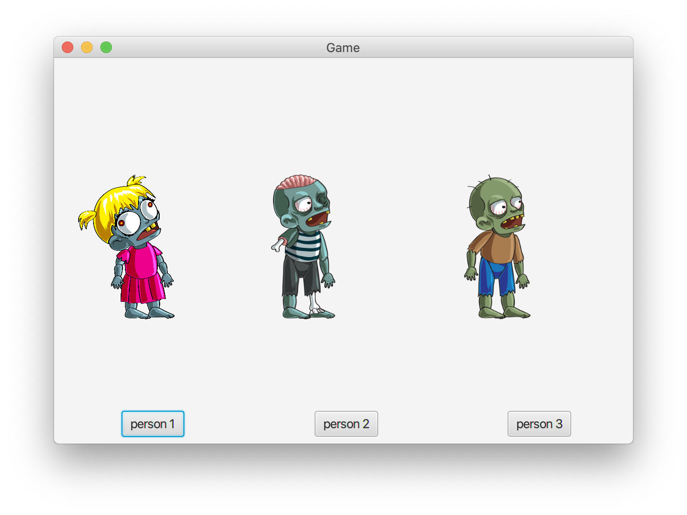
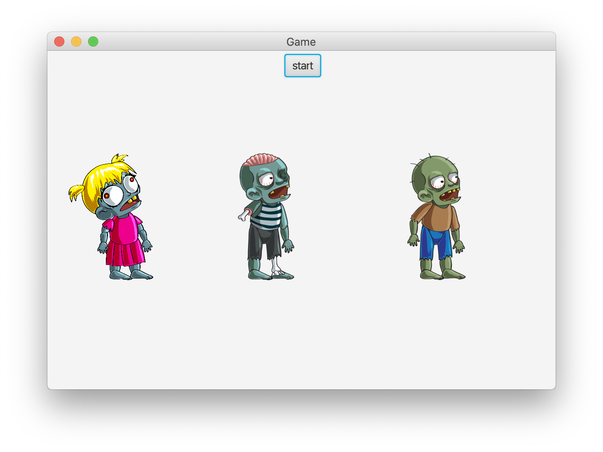

# Tamagotchi

### Инструкции по настройке
    Данное приложение не требует настроек, для того что бы запустить игру ее нужно
    клонировать в пустую папку и в программе IntelliJ IDEA или в любой другой удобной
    для вас IDE которая сможет полноценно работать с java. Для управлением игрой пользуйтесь
    файлом data.json
    
---

### Инструкции по установке
    Создайте пустую папку в ручную в любой удобной для вас директории, или можете воспользоваться
    командой для CMD под Windows или Терминалом под Linux длее клонируем проект и открываем.

**Windows и Linux**: 
    Посмотреть в какой дирректории вы сейчас находитесь `ls`
    Перемещаться по дирректориям можно с помощью команды `cd (имя папки/)`
    Создать папку можно с помощью команды `mk (название папки)` или `mkdir (можно прописывать путь) (название папки)`
    На следующем этапе что бы продолжать пользоваться командной строкой необходим git, как установить смотрить по ссылке
    [git-scm.com](https://git-scm.com/book/ru/v2/Введение-Установка-Git)
    Находясь в созданной дирректории командой `git clone https://github.com/Shchepetkov/tamagotchi.git` клонируем проект,
    далее заходим в IDE и открываем этот проект, запустить приложение можно будет в классе Application
    
---

### Инструкции по эксплуатации
**ВНИМАНИЕ вся анимация есть только у plaer1 при выборе другого персонажа анимация не полная!!!**

    При первом запуске откроется окно как на картинке ниже.

    Кнопкой старт можно перейти к выбору персонажа 

    После выбора персонажа нужно будет нажать на кнопку start

    Если персонаж ранее не создавался то первый старт будет рождение

    Если персонаж был ранее создан откроется другая анимация

    В игровом окне есть кнопку накормить при нажатии на неё

    Если персонажа покормить 3 раза он испачкается

    После чего его нужно помыть

    Последняя анимация это смерть

---

### Известные недочеты

+ Нет анимации всех персонажей
+ Класс GameControlle можно улучшить
+ Анимацию можно сделать игровую(тайлами) а не gif
+ Приложение стало бы лучше если использовать REST
+ Можно добавить регистрацию пользователей
